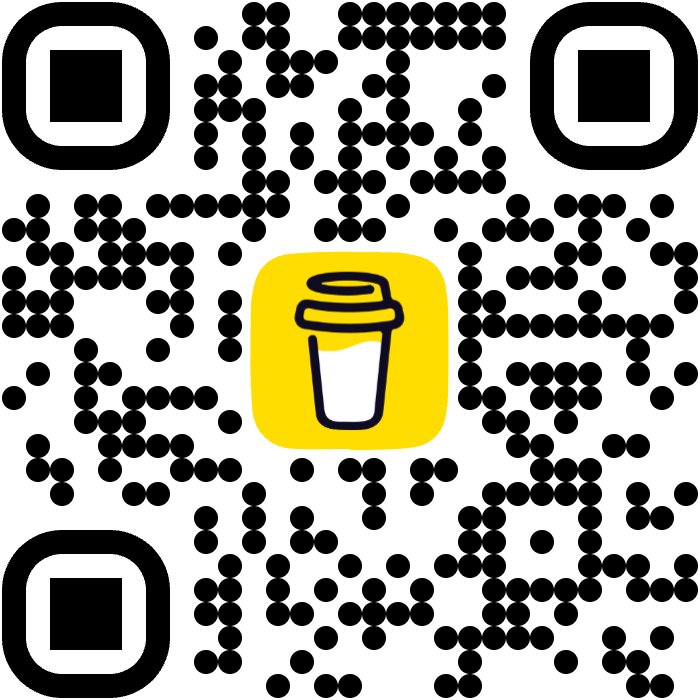

<p align="center">
  
</p>

<h1 align="center">Intervals.icu for Home Assistant</h1>

<p align="center">
Bring your training, recovery, records and health data from <strong>Intervals.icu</strong> into Home Assistant.
</p>

<p align="center">
  <a href="https://github.com/pepka69/ha-intervals-icu/blob/develop/README.fr.md"><strong>🇫🇷 Documentation complète en français</strong></a>
</p>

<p align="center">


</p>

---

## What it provides

| Training | Activity | Health | Home Assistant |
|---|---|---|---|
| Fitness, Fatigue and Form | Latest activity | Weight | Config flow |
| FTP | Human-readable duration | Body composition sensors | Multi-athlete support |
| Weekly and monthly statistics | French sport names | Resting heart rate | Diagnostics |
| Planned workouts | Personal records | HRV and sleep | Manual refresh service |
| Historical trends | Training load | Custom HA sensors | Lovelace card |

The integration creates native Home Assistant entities and a compact **Dashboard sensor** containing the main Intervals.icu data in one place.

---

## Lovelace card

The included card can display:

- Fitness, Fatigue and Form;
- FTP and weekly statistics;
- training history;
- planned workouts;
- personal records;
- latest activity;
- health and body-composition values;
- custom Home Assistant health sensors;
- multiple athletes.

Sections can be enabled or hidden from the visual card editor.

> Screenshots are being prepared. The repository already contains the expected filenames and instructions in `.github/assets/screenshots/README.md`.

---

## Installation with HACS

Click the button below to open this repository directly in HACS:

[](https://my.home-assistant.io/redirect/hacs_repository/?owner=pepka69&repository=ha-intervals-icu&category=integration)

Then install **Intervals.icu for Home Assistant** and restart Home Assistant.

<details>
<summary>Manual HACS installation</summary>

1. Open **HACS**.
2. Open **Integrations**.
3. Open the three-dot menu.
4. Select **Custom repositories**.
5. Add `https://github.com/pepka69/ha-intervals-icu`.
6. Select **Integration**.
7. Install **Intervals.icu for Home Assistant**.
8. Restart Home Assistant.

</details>

Then go to:

```text
Settings → Devices & services → Add integration
```

Search for:

```text
Intervals.icu
```

You will need your Intervals.icu **Athlete ID** and **API key**.

---

## Lovelace resource

Add this resource once:

```text
/ha_intervals_icu/ha-intervals-icu-card.js
```

Resource type:

```text
JavaScript module
```

After that, add **Intervals.icu Card** from the dashboard card picker.

---

## Beginner documentation

### Français

- [Guide complet](https://github.com/pepka69/ha-intervals-icu/blob/develop/README.fr.md)
- [Créer le compte, trouver l’Athlete ID et la clé API](https://github.com/pepka69/ha-intervals-icu/blob/develop/docs/fr/installation.md)
- [Configurer plusieurs athlètes et les capteurs](https://github.com/pepka69/ha-intervals-icu/blob/develop/docs/fr/configuration.md)
- [Installer et personnaliser la carte](https://github.com/pepka69/ha-intervals-icu/blob/develop/docs/fr/lovelace.md)
- [FAQ](https://github.com/pepka69/ha-intervals-icu/blob/develop/docs/fr/faq.md)
- [Dépannage](https://github.com/pepka69/ha-intervals-icu/blob/develop/docs/fr/depannage.md)

### English

English documentation is being expanded. The main installation steps are available in this README.

---

## Custom health sensors

A value can come from Intervals.icu or from any Home Assistant sensor.

Examples:

- weight;
- body fat;
- muscle mass;
- bone mass;
- body water;
- visceral fat;
- BMI;
- metabolic age;
- resting heart rate;
- HRV;
- sleep;
- VO₂max;
- SpO₂;
- respiratory rate;
- body temperature;
- stress;
- daily calories.

This makes it possible to use a non-Garmin scale or any other health integration already connected to Home Assistant.

---

## Multiple athletes

Add one configuration entry per Intervals.icu athlete.

Each athlete gets a separate Home Assistant device. In the card editor, select the corresponding device so the card only uses that athlete’s entities.

---

## Requirements

- Home Assistant 2026.1 or newer;
- HACS for the recommended installation method;
- an Intervals.icu account;
- an Intervals.icu Athlete ID;
- an Intervals.icu API key.

---

## Support

Open a GitHub issue for bugs or feature requests.

Include:

- Home Assistant version;
- integration version;
- steps to reproduce;
- relevant logs;
- diagnostics when appropriate.

Do not publish your API key.

---

## Roadmap and contribution

- [Roadmap](https://github.com/pepka69/ha-intervals-icu/blob/develop/ROADMAP.md)
- [Project vision](https://github.com/pepka69/ha-intervals-icu/blob/develop/VISION.md)
- [Contributing](https://github.com/pepka69/ha-intervals-icu/blob/develop/CONTRIBUTING.md)
- [Changelog](https://github.com/pepka69/ha-intervals-icu/blob/develop/CHANGELOG.md)

---

## License

MIT License.

<p align="center">
Made with ❤️ for the Home Assistant and Intervals.icu communities.
</p>

---

## 🍺 Buy me a beer

This integration is developed voluntarily in my free time.

If it is useful to you and you would like to support its development, you can buy me a beer.

<p align="center">
  <a href="https://buymeacoffee.com/pep_ka">
    
  </a>
</p>

<p align="center">
  <strong><a href="https://buymeacoffee.com/pep_ka">🍺 Buy me a beer</a></strong>
</p>
